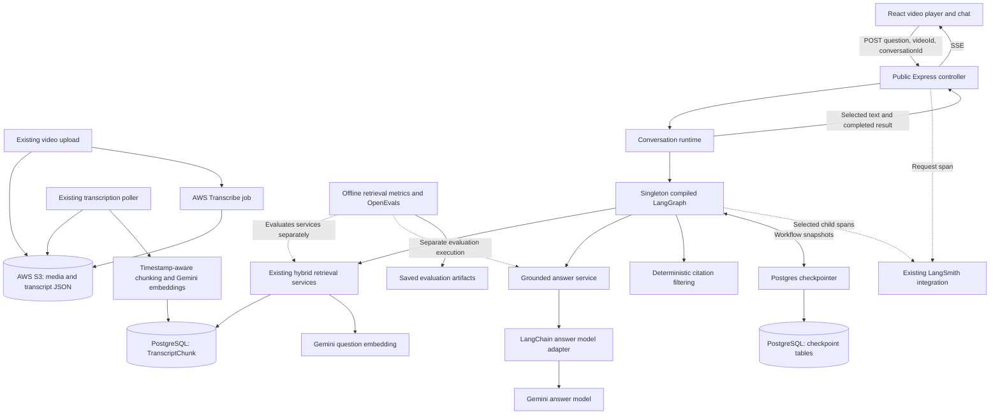
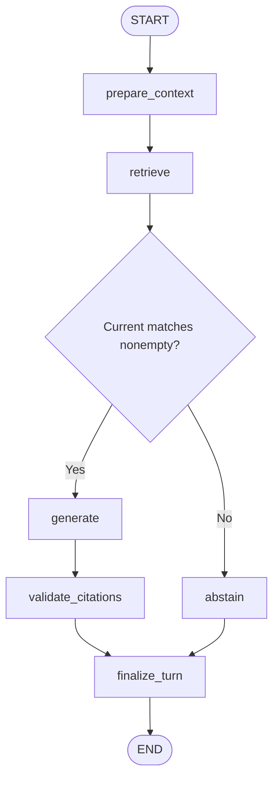

# ByteLearn V2: Final Architecture Map

Design date: 2026-09-21

Status: target design for the agreed reduced-scope release, not a claim that all
components are implemented. The current production answer still uses the raw
Gemini SDK. LangChain migration, LangGraph, and checkpoint persistence are planned.

Use [the handoff plan](BYTELEARN_V2_HANDOFF_PLAN.md) for learning prompts,
implementation order, and stage gates. This document describes where that work
ends: responsibilities, connections, state, lifecycle, and interview explanations.
Proposed filenames and function signatures are design guidance, not installed API
documentation. Verify framework APIs against the versions selected at implementation.

## 1. What the final product does

A visitor opens a prepared video and asks a question without signing in. The
backend retrieves evidence from that video's transcript, streams an answer, and
returns timestamp citations. Follow-ups can refer to the recent discussion.
PostgreSQL preserves the conversation's state across backend restarts.

The final release includes a New conversation action and bounded recent history.
It does not include searchable chat archives, automatic restoration of old message
bubbles, authenticated conversation ownership, or durable learner preferences.

There are three separate workflows:

| Workflow | Trigger | Output | Runs on every question? |
| --- | --- | --- | --- |
| Video preparation | Existing upload/transcription pipeline | Timestamped, embedded transcript chunks | No |
| Conversational answering | Public answer request | Streamed text, answer, cited sources, updated conversation | Yes |
| Offline evaluation | Explicit developer evaluation command | Stored benchmark/judge results | No |

The remainder of the application—users, roles, quizzes, playlists, progress,
bookmarks, comments, likes, subscriptions, recommendations, and dashboards—remains
alongside these workflows. It is not moved into LangGraph.

## 2. System-level map



Transcript tables and checkpoint tables may be in the same PostgreSQL database,
but they store different things and have different owners. The diagram shows
logical dependencies; it does not imply all calls run in parallel. The existing
hybrid service executes dense retrieval and then lexical retrieval.

## 3. Ownership: the boundaries that remain stable

| Component | Owns | Receives / returns | Must not own |
| --- | --- | --- | --- |
| React video chat | Visible messages, loading/error state, conversation ID, stream parsing, reset | User input; SSE text and final source metadata | SQL, graph state mutation, model credentials |
| Video player | Playback and seeking | Timestamp in milliseconds via existing seek callback | Evidence retrieval or answer generation |
| Express route | Public endpoint registration | HTTP request to controller | Workflow logic or authentication requirement for RAG |
| Answer controller | Request validation, SSE headers/events, transport cancellation, request trace root | Public request -> runtime call -> HTTP response | SQL, prompt construction, message reducers |
| Conversation runtime | Shared graph access, thread key derivation, same-thread admission, event selection, invocation lifecycle | Plain request input and request-scoped cancellation -> text/result | Express objects, factual evidence policy, provider prompts |
| LangGraph definition | State schema, nodes, transitions, turn completion | Current state -> partial state updates | HTTP, SQL implementation, client construction per node |
| Context helper | Deterministic follow-up resolution | Current question plus recent human context -> retrieval query | Treating history as evidence or making another model call |
| Hybrid retriever | Existing dense + lexical search and fusion | videoId + retrievalQuery -> up to five evidence matches | Conversation storage, HTTP, answer prose |
| Grounded answer service | Grounding instructions, source labels, question/evidence messages, text accumulation | Question/subject + matches -> answer text and streamed text | Retrieval, checkpoints, HTTP responses |
| Answer model adapter | Configured ChatGoogle boundary and text-output normalization | LangChain messages -> response/text chunks | Transcript SQL, citation policy, SSE, learner memory |
| Citation validator | Valid retrieved-and-cited source metadata | Final answer + current matches -> sources | Claim-level truth judging or rewriting streamed text |
| History helper | Completed-pair cleanup and recent-four-turn bound | Message state -> supported removal/update operations | Summarization or deleting historical checkpoint rows |
| Checkpointer module | Singleton saver/pool ownership and cleanup | Framework checkpoint reads/writes | Product chat lists, user profiles, evidence retrieval |
| LangSmith wrapper | Existing trace hierarchy and selected logging | Explicit safe summaries | Deciding answers or storing conversational truth |
| Offline evaluators | Retrieval metrics and semantic assessments | Explicit benchmark examples and outputs -> results | Blocking a visitor's live response |

These are logical responsibilities, not a mandate to create a separate class or
file for each row. Keep small helpers together until separation aids clarity.

## 4. Proposed final file map

Legend: E = existing and reused; M = existing and modified; N = proposed new file.
Names for N files are recommended; implementation may consolidate small helpers.

```text
Frontend/src/components/
  VideoChatBody.jsx                         M  identity, stream parsing, reset
  existing player/parent components         E  timestamp seeking

Backend/
  BYTELEARN_V2_HANDOFF_PLAN.md               E  staged learning/implementation
  BYTELEARN_V2_ARCHITECTURE_MAP.md           N  this target design
  package.json / package-lock.json          M  direct runtime dependencies
  scripts/
    setup-checkpointer.js                  N  explicit idempotent schema setup
    rebuild-chunks.js                      E  existing ingestion utility
  src/
    index.js                               M  initialize/close runtime resources
    app.js                                 E  existing API mounts/middleware
    routes/embedding.routes.js              E  keep answer route public
    controllers/embedding.controllers.js    M  delegate answer flow, retain SSE
    graphs/
      conversationalRagGraph.js             N  schema, nodes, edges, factory
    runtime/
      conversationRuntime.js                N  singleton, identity, admission,
                                              cancellation and event selection
    persistence/
      conversationCheckpointer.js           N  saver construction/pool lifecycle
    models/
      answerChatModel.js                    N  ChatGoogle model boundary
    services/
      ragAnswerService.js                   M  grounded messages and generation;
                                              reusable citation validator
      conversationContext.js                N  follow-up and history helpers
      hybridTranscriptRetriever.js          E  frozen orchestration
      denseTranscriptRetriever.js           E  frozen cosine SQL + query embedding
      lexicalTranscriptRetriever.js         E  frozen PostgreSQL FTS
      reciprocalRankFusion.js               E  frozen rank fusion
      chunkingService.js                    E  prepare/store transcript evidence
    db/index.js                            E  existing application DB ownership
    observability/langsmithTracer.js        E  preserve; fix only proven gaps
    utils/
      geminiEmbedding.js                    E  embedding model remains separate
      chunking.js                           E  timestamps and chunk construction
      transcribe.utils.js                   E  start transcription jobs
      transcriptionPolling.js               E  process completed jobs
      supermemory.js                        E  legacy quiz use; not public RAG
    test/                                  M  focused tests for each changed layer
  prisma/schema.prisma                     E  no Conversation/Message models
  evals/                                   E  frozen evaluation code/artifacts
```

The answer service can continue exporting validateCitations. The graph's
validate_citations node calls it once. A separate citation file is optional, not
an architectural requirement. Existing non-answer exports such as chunkAndEmbed
remain intact when editing the shared controller.

## 5. Video preparation: where factual evidence comes from

This path exists already and stays outside the conversational graph:

1. The existing upload flow obtains an S3 location and creates video metadata.
2. Publishing starts an AWS Transcribe job for the stored media.
3. The poller checks processing jobs, then reads transcript output from S3.
4. Full transcript content/status are stored through Prisma.
5. chunkingService loads timestamped AWS items and builds chunks. Current code
   targets about 500 characters, respecting timestamp-aware units; this is not
   a 500-token guarantee.
6. Gemini embeds chunk text; the current pipeline stores 768 dimensions.
7. It validates prepared chunks, then replaces that video's chunk rows within
   a database transaction. Only after successful preparation is status READY.

TranscriptChunk contains video scope, text, chunk index, start/end milliseconds,
and the embedding. A question searches these prepared rows; it does not run
transcription or regenerate all video embeddings.

There are two distinct Gemini uses: embedding text into vectors and generating
answer prose. Stage 1 changes the latter interface only.

## 6. Final graph: one turn at a time



| Node | Reads | Writes / work | External dependency |
| --- | --- | --- | --- |
| prepare_context | New question, retained completed human turns, videoId | Clean prior incomplete turn according to policy; append current HumanMessage once; reset turn fields; derive retrievalQuery | None |
| retrieve | videoId, retrievalQuery | Replace matches with fresh hybrid retrieval results | Gemini embeddings and PostgreSQL |
| evidence route | Current matches | Choose abstain or generate using matches.length > 0 | None |
| abstain | No evidence required | Exact canonical answer, sources: []; emit one answer-text event | None |
| generate | Exact question, resolved subject/query, new matches | Stream text; set answer only when generation completes successfully | Answer service -> adapter -> Gemini |
| validate_citations | Completed answer, current matches | Replace sources with valid cited metadata | Pure validation, optional tracing |
| finalize_turn | Successful answer, sources, message state | Append completed AIMessage once; retain last four completed pairs | Checkpointer operated by graph runtime |

Nodes return state updates. They do not call res.write, fetch their own database
clients, or directly write checkpoint tables. The framework's checkpointer saves
graph progress; finalization is the application's completed-turn boundary.

For fresh requests after a failed turn, preparation must clear incomplete
conversation inputs and stale per-turn fields. Resuming an interrupted graph run
is a different operation from submitting a new question; the runtime must not
silently mix the two. Failure/retry tests choose and prove the supported behavior.

## 7. State map: what lives where

Conceptual graph state (not a copy-paste framework schema):

```js
{
  messages: [],       // human/AI messages with stable IDs and a message reducer
  videoId: "...",    // fixed video scope of this thread
  question: "...",   // exact current input after validation/normalization
  retrievalQuery: "...", // may include prior human subject; not evidence
  matches: [],        // fresh transcript rows for this turn
  answer: "",       // completed generated/canonical text
  sources: []         // validated current-turn citation metadata
}
```

| State/data | Owner and lifetime | Survives backend restart? | Factual authority? |
| --- | --- | --- | --- |
| Visible message bubbles / pending text | React component memory | Not through reload; unrelated to backend restart if page stays open | No |
| Per-video conversationId | Browser sessionStorage | Yes while that browser session storage remains | No |
| Current request ID, cancellation, event sink | Runtime invocation only | No | No |
| Compiled graph, model client, DB pool, saver | Server process singletons | Recreated on restart | No |
| Active graph messages | Latest saved checkpoint, max four completed pairs | Yes | Reference-resolution context only |
| Current question/query/answer/sources/matches | Graph state, reset/replaced per turn | Can be included in checkpoints | Only fresh retrieved matches support the current answer |
| Historical checkpoints | Checkpointer tables | Yes | Never reused as new factual evidence |
| Transcript chunks and embeddings | Existing PostgreSQL application tables | Yes | Retrieval selects this turn's factual evidence |
| Trace records | LangSmith | Independent of backend lifetime | Execution diagnostics, not answer evidence |

Checkpoint persistence can store full graph state, including transcript matches
and answer text. Avoiding those payloads in LangSmith does not mean they are
absent from PostgreSQL checkpoints. These are different storage boundaries.

Do not store req, res, callbacks, AbortController objects, model clients, database
clients, API keys, or trace clients in graph state. Runtime dependencies are
supplied outside the state using APIs supported by the selected framework version.

Trimming active messages does not delete old checkpoints. A four-turn bound also
is not a fixed token budget. Separate retention/token policies are deferred.

## 8. Identity, singleton lifetime, and concurrency

Example conceptual identity mapping:

```text
Browser storage key: bytelearn:conversation:<videoId>
Browser value:       <random UUID>
Internal thread_id:  bytelearn:video:<videoId>:conversation:<UUID>
```

Use validated identifiers and an unambiguous encoding for the internal key.
The browser sends conversationId, not an arbitrary internal thread_id. The
backend derives and checks video scope; saved state must not contradict it.

- Same video + same conversationId: continue that conversation.
- Same video + new conversationId: separate conversation.
- Different video + same conversationId: separate conversation.
- New conversation: cancel pending work, create a new ID, clear visible chat.
  It does not delete the previous thread's database records.
- Reload: sessionStorage can preserve the ID and the backend can continue the
  conversation. Old message bubbles are not automatically reconstructed.
- Backend restart: runtime objects are rebuilt; checkpoints remain in Postgres.
- End of browser storage session: the UI may lose the resume ID even though
  checkpoints remain in the database. No archive/listing feature is planned.

A UUID is not authenticated ownership. Someone possessing the video ID and
conversation ID can attempt continuation. This public design must not be sold
as account-bound private chat or authenticated user isolation.

One compiled graph serves many threads; it does not hold one shared conversation
array. One shared runtime does not mean one conversation for all visitors.

Proposed single-instance overlap policy: admit at most one active request per
thread and reject a second with HTTP 409 before opening its SSE stream. Different
threads remain independent. Hold admission until the first operation actually
unwinds, including cancellation, and release it in finally. The chosen policy
must be tested; it is not implemented today. A process-local guard does not
coordinate multiple server replicas. Multi-replica writes require a later design.

## 9. End-to-end walkthrough: Q1, Q2, and restart

Use a video whose transcript actually contains the example concept:

1. Browser sends Q1: "What does the change-in-balance function do?", videoId V,
   and conversationId C.
2. Controller validates input and opens one request trace. Runtime derives V+C,
   admits the request, and invokes the graph with that thread's configuration.
3. The checkpointer supplies existing state, or the graph starts a new thread.
4. prepare_context records the human question and resets matches/answer/sources.
5. Retrieval embeds the search text, queries transcript rows for V, performs FTS,
   and fuses the rankings. Up to five chunks are supplied to generation.
6. The answer service makes SystemMessage instructions and HumanMessage data.
   The adapter streams Gemini text; the runtime selects only answer output.
7. The controller forwards selected text as SSE. React progressively renders it.
8. Validation maps actual cited source IDs back to retrieved chunk timestamps.
9. Finalization appends the completed AI message and applies the history policy.
10. After successful graph completion/persistence, the controller sends done
    with the final answer and sources, ends HTTP, and releases admission.
11. Q2 asks "Why is that useful here?" using V+C. Preparation can build a query
    containing the preceding human subject and Q2. It retrieves evidence again.
    It does not use Q1's assistant answer as proof.
12. After backend restart, Q2 can still access Q1's saved human context because
    the same scoped thread selects the PostgreSQL checkpoint.

The deterministic contextualizer is deliberately limited. Repeated ambiguous
follow-ups, distant references, and topic changes may need clarification or
abstention. Do not advertise arbitrary conversational understanding.

## 10. Model adapter and answer service contracts

Illustrative application contracts, not mandated exported names:

```text
answer service:
  buildGroundedMessages({ question, resolvedSubject, matches }) -> messages
  generateGroundedAnswer({ messages, signal, emitText }) -> completed answer
  validateCitations(answer, matches) -> sources

model adapter:
  invoke(messages, invocationOptions) -> completed model message
  streamText(messages, invocationOptions) -> async iterable of text

runtime:
  runConversation({ videoId, conversationId, question }, requestContext)
    -> selected text events and a final { answer, sources }
```

The exact runtime event API is selected during graph integration. The stable
contract is that text is emitted once, callbacks are invocation-local and outside
state, errors propagate, and completion follows graph success. Do not forward
both callback text and framework model events for the same output.

The adapter may internally own an injected model instance; a test can supply a
fake model. Production constructs the configured instance once. There is no need
to instantiate ChatGoogle for every token or move retrieval into LangChain.

Preserve gemini-2.5-flash-lite, GEMINI_API_KEY passed explicitly, temperature 0.7,
topP 0.95, topK 64, maxOutputTokens 8192, and text-output intent. Resolve exact
constructor options and the @langchain/google Node export against the selected
package version. Keep the existing embedding integration and frozen evaluator
integration separate.

SystemMessage contains tutor, evidence, citation, and abstention instructions.
HumanMessage contains the question/resolved subject and labeled transcript data.
Do not append prior AI answers as factual context. No personalization memory is
supplied on this public RAG path.

Normalize text from AIMessageChunk using verified accessors/content handling.
content may contain structured blocks; never assume every chunk is a string or
send the entire framework message object to the frontend.

## 11. Streaming contract: model output to UI

```text
Gemini generation
  -> LangChain AIMessageChunk
  -> adapter's normalized text
  -> answer service / generate node
  -> request-local selected output from runtime
  -> controller's SSE frame
  -> network byte chunks
  -> browser UTF-8 decoder + persistent frame buffer
  -> React pending answer
```

These are not identical units: a model token, a model chunk, an SSE event, and a
network read can each have different boundaries.

Preserve the public protocol:

```text
event: start
data: {"videoId":"V"}

event: token
data: {"text":"The function "}

event: token
data: {"text":"... [Source 1]."}

event: done
data: {"answer":"The function ... [Source 1].","sources":[...]}

```

Only generate/abstain output becomes visible text. Graph state updates, checkpoint
events, diagnostic spans, and any future hidden model call are not answer tokens.

The UI must keep an incomplete-frame buffer across reads and process only complete
SSE frames. The current parser splits each decoded read independently and ignores
partial JSON errors, so Stage 4 must correct that transport gap. Retain a usable
AbortController for reset/navigation and ensure old streams cannot update a new
conversation. On done, reconcile the visible answer with the final answer and
apply the sources array, including an empty array. Never append the full done
answer after already appending all token events.

Tokens are provisional output. Final citation validation occurs after generation;
it does not retroactively prove the truth of text already displayed. If execution
fails, the UI marks the pending answer as failed/incomplete rather than successful.

## 12. Abstention and citations

| Situation | Behavior | Strength of guarantee |
| --- | --- | --- |
| Fresh hybrid retrieval is empty | Canonical text, sources: [], no answer-model call; finalize a valid abstention turn | Deterministic branch |
| Matches exist but are insufficient | Prompt instructs Gemini to return canonical abstention | Model-dependent |
| Answer equals canonical abstention | Citation validator returns [] | Deterministic |
| Answer contains [Source N] | Return metadata only if N is among current retrieved sources | Deterministic ID validation |
| Citation exists but does not support claim | Current validator cannot establish semantic support | Known limitation |

Even empty-result abstention normally follows a Gemini embedding request. It
saves answer generation, not all model-related calls. The unnecessary baseline
memory classifier disappears from public RAG in Stage 1.

Final source shape is preserved:

```js
{
  sourceId: 1,       // rank-based label within this turn, not a global row ID
  chunkIndex: 12,
  startMs: 123000,
  endMs: 129000,
  similarity: 0.82  // can be null for lexical-only results
}
```

Source 1 in Q2 can refer to a different transcript chunk than Source 1 in Q1.
The frontend resolves citations within each answer's own sources array and uses
the existing onSeekToMs callback for playback navigation.

## 13. Persistence and process lifecycle

Deployment/setup path (planned):

1. Install directly declared backend dependencies and configure the database URL.
2. Run the dedicated checkpointer setup command against the intended development
   or deployment database with appropriate authority. Verify idempotence and
   actual Supabase connection/pooler compatibility.
3. Start the server. Construct the application DB client, model adapter,
   checkpointer, and compiled graph under clear singleton ownership.
4. Admit conversation requests only when persistent runtime initialization succeeds.
5. On shutdown, stop admitting new work, settle/cancel active work appropriately,
   and close owned resources. Do not close a shared application pool from an
   individual request or introduce new ingestion infrastructure.

The checkpointer can use LANGGRAPH_DATABASE_URL, falling back to DATABASE_URL only
when compatible. Reusing the database does not require sharing the same pool;
keep connection ownership explicit and avoid per-request pool creation.

Framework checkpoint storage owns its own tables and serialization. Prisma
continues owning existing application models; no Conversation/Message models are
added. State fields are persisted using the supported message serializer.

After a failure there may be intermediate checkpoints. The important application
guarantee is that a partial response is not represented as a completed AI turn.
After a completed checkpoint commit, the connection can still fail before the
browser receives done. Therefore persistence is not exactly-once delivery, and
blind retries are not guaranteed to be idempotent.

## 14. Tracing and offline evaluation: supporting paths

LangSmith already exists. Preserve one request root and selected nested spans:

```text
ByteLearnAnswerRequest
  graph execution / node spans (if enabled and safely summarized)
    prepare_context
    hybridRetrieval
      denseRetrieval
      lexicalRetrieval
      reciprocalRankFusion
    groundedGeneration             [only when evidence exists]
    citationValidation             [only on generation branch]
    finalize_turn
```

This is a logical target hierarchy, not a promise of exact automatic span names.
Node/model spans may be nested differently according to framework integration;
tests must enforce a single root, correct relationships, and payload boundaries.
The old learnerMemory span is removed from public RAG.

Record selected question/identifier fields and operational summaries: counts,
source IDs, answer length, model configuration, timings and errors as appropriate.
Existing tracing is not anonymous or timing-only. Do not accidentally record full
transcripts, complete prompts/answers, credentials, or HTTP objects when enabling
LangChain/LangGraph instrumentation. Automatic tracing requires deliberate control
and tests; manual filtering does not automatically sanitize other library spans.

Optional telemetry should fail open. Existing tracing-disabled tests are useful
but do not establish that every client/network failure is already handled.

Offline evaluation remains separate from user requests:

- Retrieval metrics evaluate ranking against the frozen timestamp evidence.
- OpenEvals code evaluates properties such as correctness and groundedness.
- No online LLM judge is inserted after each user answer.
- Saved hybrid results cover 53 answerable questions of a 61-example dataset:
  Recall@5 91.2%, MRR@5 76.3%. The dense artifacts report 88.1% and 68.9%.
- The semantic artifact is incomplete at 6/61. Do not claim completed semantic
  quality measurements or rerun experiments as part of this roadmap.

## 15. Failure and completion map

| Failure/event | Visible behavior | State/runtime behavior |
| --- | --- | --- |
| Invalid input/UUID | HTTP validation error before SSE | No graph invocation |
| Same thread already active | Proposed HTTP 409 before SSE | Existing run continues; second run not started |
| Core retrieval/embedding failure | HTTP error if unopened, otherwise one SSE error when writable | No completed AI answer |
| Lexical-only retrieval failure | Existing dense-only fallback | Preserve frozen lexical behavior |
| Gemini answer failure | Error, no done; partial UI text is incomplete | Do not finalize partial answer |
| Checkpointer failure | Explicit conversation service error | No silent MemorySaver fallback |
| LangSmith failure | Normal grounded answering where optional telemetry can be bypassed | Do not make telemetry a critical dependency |
| Missing Supermemory key/service | Public RAG remains independent | Guard unrelated import-time initialization if needed |
| Client disconnect/reset | Stop sending; cancel work as supported | No finalization from known-incomplete generation; release guard after unwind |
| Disconnect after completed commit | Browser may miss completion | A completed checkpoint may already exist; not exactly-once delivery |

The controller sends error only while writable, terminates once, and never sends
done after failure. It does not fabricate canonical abstention to disguise an
infrastructure failure. Unsupported evidence and unavailable infrastructure are
different outcomes.

## 16. Verification ownership

| Layer | Focused proof |
| --- | --- |
| Model adapter | invoke result, multi-chunk text order, empty/structured content handling, fake-model injection |
| Answer service | Grounded message composition, no old AI evidence, accumulation, canonical abstention and citations |
| Graph | Q1/Q2 context, fresh retrieval, stale-field reset, conditional branches, one completed AI turn |
| Runtime | Thread/video scope, singleton use, same-thread conflict, cancellation, event selection |
| HTTP/SSE | Validation, public access, event order, one done/error, no duplication |
| Browser | Frames split across reads, multiple frames/read, final reconciliation, reset/navigation isolation, timestamp seeking |
| Persistence | Real restart continuity, separate-thread state, idempotent setup, pool cleanup and failure behavior |
| History | Ten-turn run, four completed pairs, IDs/removals, failure then success, expired references |
| Observability | Existing hierarchy preserved, no duplicate root, no automatic raw payload capture, failure cases |
| Final demo | Supported Q1/Q2, restart, reset, abstention, citations, failure display |

Keep the existing full backend suite green and add focused coverage where it is
missing. Unit tests of metric functions are not benchmark reruns. Tests with fake
Gemini/Postgres cannot replace the live restart and browser acceptance checks.

## 17. How Stage 1 grows into this design

| Stage | Introduces/changes | Boundary kept |
| --- | --- | --- |
| 0 | Records actual behavior and coverage | No source edits |
| 1 | ChatGoogle adapter, role-separated grounded messages, removal of public memory calls | Controller still owns HTTP; retriever stays custom |
| 2 | Test-only graph exercise | Production path unchanged |
| 3 | Graph definition, context/history helpers, in-memory runtime | Services remain reusable; HTTP not connected yet |
| 4 | Runtime/controller/UI connection, identity and robust SSE handling | Source payload and public access preserved |
| 5 | Postgres checkpointer and lifecycle | Graph's business flow stays the same |
| 6 | Completed-pair trimming | No summarization or new evidence source |
| 7 | Deferred | No long-term learner-memory project |
| 8 | Necessary failure fixes/tests | Existing optional tracing preserved |
| 9 | Complete-journey proof | No new evaluation framework |
| 10 | Accurate setup, architecture and resume docs | No behavior changes |

Stage 1 is not throwaway work. The model adapter still talks to Gemini in the
final system. Later the graph takes over coordination from the controller, and
generation/citation validation become separately callable responsibilities.
Extract functions only when needed; do not build every future module in Stage 1.

## 18. Interview responsibility map

| Technology/component | One precise explanation |
| --- | --- |
| AWS Transcribe | Converts video audio into transcript text with timing information. |
| Gemini embeddings + pgvector | Represent questions/chunks as vectors and retrieve similar transcript passages. |
| PostgreSQL FTS + RRF | Add lexical matches and fuse rank positions from both retrieval methods. |
| LangChain | Supplies the answer-model/message interface and streamed model chunks. |
| LangGraph | Coordinates state updates and evidence-based routing for a conversation turn. |
| PostgreSQL checkpointer | Stores graph snapshots so the same thread can continue after restart. |
| Express SSE | Delivers selected answer text progressively over the HTTP response. |
| Citation validator | Maps valid current-turn references to timestamp metadata; not a truth judge. |
| LangSmith | Observes request execution through selected spans and summaries. |
| OpenEvals | Supports offline answer-quality assessment, separate from live serving. |

Suggested explanation after implementation and verification:

> A public question enters Express with a video and conversation ID. The server
> selects a persistent graph thread, uses recent human context to clarify a
> follow-up, and retrieves fresh transcript evidence through hybrid PostgreSQL
> search. With no evidence it returns a fixed abstention. Otherwise Gemini streams
> an answer through a small LangChain adapter, and we validate cited source IDs
> into video timestamps. Express delivers the text through SSE. PostgreSQL stores
> graph state, while LangSmith records selected execution metadata. History helps
> interpret questions but never replaces transcript evidence.

Do not claim the target as implemented until the corresponding stage checks pass.
