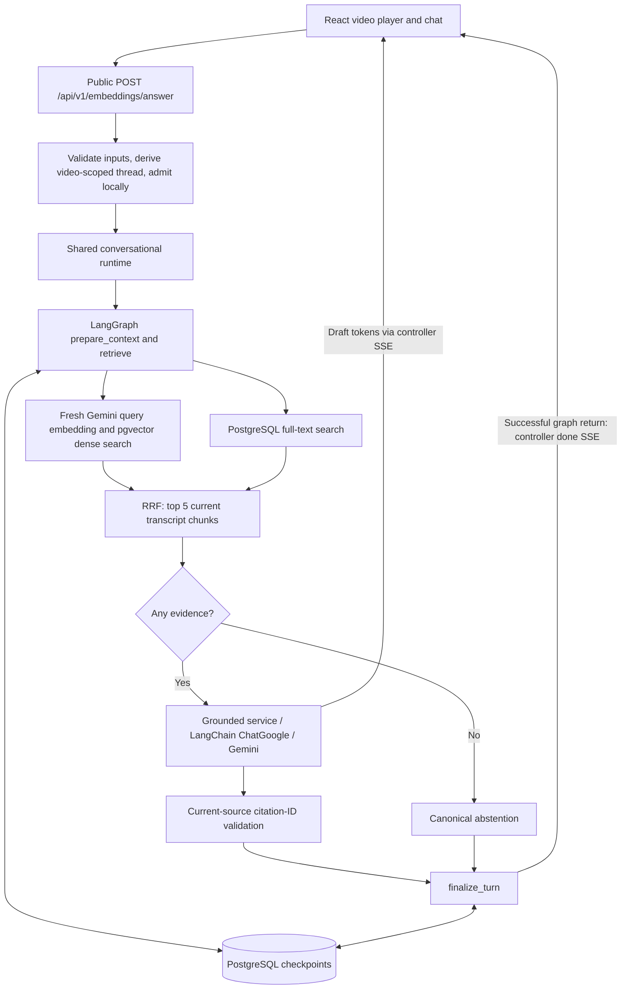

# ByteLearn: final implemented architecture

Stage 10 reconciliation, 2026-09-24, against production code at `eedc0e9` plus
the bounded S3 import repair recorded in the root evidence summary. This replaces
the earlier target map with the implemented architecture. Historical stage evidence
remains unchanged. [Setup](README.md), [API](API.md#embeddings--ai-qa)
and [acceptance](docs/stage-9-acceptance.md) describe distinct configuration,
transport and verification boundaries.

## System flow

ByteLearn is a public transcript-grounded video tutor with short follow-ups,
streaming and timestamp citations. The workflow has no autonomous agent/tool loop.
Existing upload, transcription, quizzes, accounts and dashboards remain separate.



The saver checkpoints the whole graph, including intermediate generation/validation
state, not just the two drawn nodes. Retrieval is dense **then** lexical in code;
the two paths in the diagram are logical dependencies, not parallel execution.
Both query product `TranscriptChunk` rows scoped by `videoId`. Checkpoint storage
is separate from product evidence even when both use the same database.

## Responsibilities and source map

Paths below are relative to `Backend/` unless prefixed `../Frontend/`.

| Component | Owns | Does not own |
| --- | --- | --- |
| React chat: `../Frontend/src/components/VideoChatBody.jsx` | Visible messages, per-video session UUID, fetch/SSE parsing, reset/cancel; timestamp callback to `VideoDetail.jsx` | Checkpoints, SQL, authentication of conversation IDs |
| Express: `src/controllers/embedding.controllers.js` | Validation, hashed thread derivation, process-local HTTP admission, SSE and transport AbortController | Prompt/retrieval logic, database setup |
| Runtime: `src/graphs/conversationalRagRuntime.js` | Singleton initialization, injected dependencies, shared graph/resource, operation drain and close | HTTP identity derivation, prompt construction |
| LangGraph: `src/graphs/conversationalRagGraph.js` | State/reducer, node routing, narrow context, completed-pair policy, graph-level local admission | HTTP objects, SQL implementation, model/pool creation per node |
| Hybrid retriever: `src/services/hybridTranscriptRetriever.js` and dense/lexical/RRF siblings | Fresh video-scoped evidence ranking | Chat history, generation, durable checkpoints |
| Answer service/adapter: `src/services/ragAnswerService.js`, `src/models/answerChatModel.js` | Selected prompt inputs, grounded instructions, model config, streamed text and citation filtering | Retrieval, HTTP, learner personalization |
| Postgres checkpointer: `src/graphs/postgresCheckpointer.js` | Official saver and dedicated pool, readiness read, explicit setup, owned cleanup | Prisma pool, transcript retrieval, product archives, data-retention deletion |
| LangSmith: `src/observability/langsmithTracer.js` | Optional manual spans with selected inputs/outputs | Answer correctness, factual authority, conversation persistence |

Video preparation uses `src/utils/transcriptionPolling.js`, `src/services/chunkingService.js`
and `src/utils/chunking.js`: AWS transcript JSON becomes timestamp-aware chunks
(target about 500 characters, not tokens), Gemini embeddings are sliced to 768
values, validated and written by a transactional replacement of that video's
chunks. Questions search prepared rows; they do not rerun transcription.

## Identity, frontend and transport

The mounted answer endpoint is **POST `/api/v1/embeddings/answer`**, from
`src/app.js` plus `src/routes/embedding.routes.js`. It accepts JSON
`{ videoId, question, conversationId }` without JWT middleware. See the
[API contract](API.md#embeddings--ai-qa) for validation/events.

`VideoChatBody.jsx` obtains a UUID with `crypto.randomUUID()` and stores it under
`bytelearn:conversation:${videoId}` in `sessionStorage`. The controller derives:

```text
thread_id = sha256(JSON.stringify([videoId, conversationId.toLowerCase()]))
```

Same video + ID continues the checkpoint thread; new ID or different video scopes
a different thread. `videoId` is validated as nonblank but is not normalized by
the controller. **Public UUIDs are resume identifiers, internal thread IDs are
checkpoint keys, and neither is user authentication.** Possession of the video
and conversation identifiers allows an attempt to continue that thread. This is
not account-bound private chat or authenticated conversation ownership.

The HTTP controller and graph each have an in-process same-thread guard; HTTP
overlap returns 409 before SSE. Different threads can run concurrently. Admission
is held through local service unwind, including cancellation. These sets provide
**no distributed writer coordination** between backend processes.

The frontend uses `fetch` with the Axios-configured base URL, a POST JSON body and
an AbortSignal. Buffered `TextDecoder` parsing handles split UTF-8/SSE frames.
Tokens update a draft; `done` replaces it with final text and sources. Error or
premature EOF removes the draft and displays an error. Citation chips use source
`startMs`; `VideoDetail.jsx` converts milliseconds to media seconds.

Reset broadcasts abort to both mounted chat surfaces before replacing their
shared per-video ID and clearing messages. Failed storage access disables sending.
Unmount/video change cancels pending work; stale responses cannot update new chat.
Returning to a video can reuse its ID without restoring old message bubbles.
The old in-memory-lifetime comment in `VideoChatBody.jsx` is historical; production
persistence is determined by the injected Postgres saver described here.

Success is `start → token* → done`. Failure after opening emits `error` if writable,
never a later `done`; disconnect may prevent any terminal event. Tokens are visible
drafts, not proof of successful finalization. A committed turn may outlive failed
`done` delivery. There is no request idempotency key or exactly-once delivery.

## Graph, active history and factual boundary

Actual flow:

```text
START → prepare_context → retrieve
                            ├─ matches present → generate → validate_citations ─┐
                            └─ zero matches → abstain ─────────────────────────┤
                                                               finalize_turn → END
```

State fields are `messages`, `videoId`, `question`, `retrievalQuery`, `matches`,
`answer`, `sources`, `status`. Messages use `messagesStateReducer`; the remaining
fields hold their latest updates. Data projections limit matches/sources to
transcript/citation fields. Status progresses through pending, draft (generation),
validated and complete. Intermediate answers can be checkpointed drafts.
Callbacks, signals, HTTP objects, clients, pools and tracked promises stay outside
state in closures/invocation-local storage.

`prepare_context` removes unmatched failed inputs, appends the current human and
clears stale per-turn fields. `retrieve` always obtains fresh evidence. Valid zero
matches bypass generation and citation validation and set exactly:

```json
{"answer":"I couldn't find enough information in this video to answer that.","sources":[]}
```

Exceptions are failures, not evidence absence. With matches, generation receives
only the current question, fresh ranked transcript evidence, optional preceding
human question and grounding/citation instructions. **Previous AI answers never
serve as factual evidence; the whole checkpoint history is not a model prompt.**
For nonempty evidence, model instructions also require canonical abstention when
support is insufficient; this is not a deterministic semantic-support detector.

`validate_citations` filters metadata to source numbers both cited and present in
current retrieval. Rank-based IDs can refer to different chunks on different turns.
It does not establish semantic support or remove every invalid marker from answer
text. `finalize_turn` alone appends a completed AI message, checks the current human
and validated status, and retains the **newest four completed human/AI pairs**.
Canonical abstentions are completed pairs too.

Completed pairs must be adjacent human/AI messages. Failed/cancelled inputs do not
count; a failed turn can leave an unmatched human and intermediate drafts. Next
preparation removes abandoned inputs before contextualizing. Finalization uses
ID-based `RemoveMessage` updates because a shorter array would merge under the
reducer. Expired completed pairs are removed only at successful finalization.
During a pending turn, four prior pairs plus the current human may be present.
**Four pairs are not a token bound. Active trimming is not data erasure:** older
checkpoint snapshots can retain expired messages, evidence and drafts.

## Follow-up policy

`contextualRetrievalQuery` is a deterministic narrow English heuristic, not LLM
query rewriting. A question of at most 16 whitespace-separated words can inherit
only the immediately preceding completed human question when it is a recognized
continuation (for example “Why?”) or contains a backward-reference pronoun.
Recognized topic-change prefixes take precedence. The resulting retrieval query
concatenates that previous question, a newline and the current question.

Longer/standalone questions use themselves. Implicit/non-English references,
ambiguous pronouns, chains of vague follow-ups, topic changes and expired/distant
context can fail to resolve. Retaining four pairs does not mean the contextualizer
searches all four. Fresh transcript retrieval remains mandatory every turn.

## Frozen retrieval and generation configuration

| Setting | Production value / source |
| --- | --- |
| Embedding path | `src/utils/geminiEmbedding.js`, raw `@google/generative-ai` `embedContent` |
| Embedding model | `GEMINI_EMBEDDING_MODEL` or `gemini-embedding-001`; legacy `text-embedding-004` alias maps to that default |
| Embedding endpoint | `GEMINI_API_VERSION` default `v1beta`; `GEMINI_API_BASE_URL` default `https://generativelanguage.googleapis.com` |
| Vector representation | First 768 returned values for chunks/query; chunk writes validate length 768 |
| Dense | pgvector cosine similarity `1 - (embedding <=> queryVector)`, strictly `> 0.3`, top 10 |
| Lexical | PostgreSQL English FTS, `websearch_to_tsquery` with AND replaced by OR, `ts_rank_cd`, top 10; not BM25 |
| Scope | Both SQL paths constrain the same `videoId` |
| Fusion | RRF `k=60`, deduplicate database chunk IDs, descending fused rank; chunkIndex tie-break |
| Final evidence | Top 5; lexical failure returns an empty list and preserves dense-only ranking |
| Answer model | `ChatGoogle` from `@langchain/google/node`, `gemini-2.5-flash-lite`, explicit `GEMINI_API_KEY` |
| Answer settings | temperature 0.7, topP 0.95, topK 64, maxOutputTokens 8192 |

The embedding overrides do not change the fixed answer-model configuration.
LangChain is used at the answer-model/message boundary; custom retrieval, SSE and
citation logic remain application code. LangGraph owns workflow orchestration.
No retrieval settings were retuned in Stage 10.

## Persistence, lifecycle and failure

Production always injects `PostgresSaver` from
`@langchain/langgraph-checkpoint-postgres` **1.0.5**. Direct isolated graph
construction can default to `MemorySaver` for tests; there is **no production
MemorySaver fallback**. `LANGGRAPH_DATABASE_URL` is required independently of
`DATABASE_URL`; fixed schema `bytelearn_langgraph` is set up by
`npm run langgraph:setup` from `Backend/`. See [setup](README.md) for prerequisites.

One runtime owns one compiled graph and a dedicated checkpoint `pg.Pool`; Prisma
owns a separate product pool. Initialization shares one promise and verifies the
saver with a read before HTTP listening/polling. Startup never migrates, and a
readiness read does not prove all future write permissions/availability. Initialization
failure is terminal for that runtime. Graph execution uses synchronous durability.

SIGINT/SIGTERM stop accepting HTTP, drain requests/runtime work, then close the
checkpoint pool once. New runtime operations are rejected after closing begins.
The entrypoint forces a nonzero exit after 15 seconds if shutdown stalls; crashes,
SIGKILL or non-cooperative services cannot guarantee graceful cleanup. Prisma and
polling resource ownership remains separate.

| Dependency/event | Policy |
| --- | --- |
| Valid zero evidence | Exact canonical abstention, empty sources, no model call |
| Critical dense/embed/product database failure | Explicit failure; never converted to abstention |
| Lexical-only failure | Existing dense-only fallback |
| Model failure | Error; no completed partial AI from incomplete generation |
| PostgreSQL checkpoint failure | Explicit failure; no memory fallback; final commit acknowledgement can be ambiguous |
| LangSmith failure | Fail open where optional; preserve original work/result once; not a universal SDK/network guarantee |
| Supermemory unavailable | Public RAG unaffected; legacy quiz subsystem is separate |
| Client disconnect | Cancel/unwind; no known-incomplete finalization; an already committed turn remains committed |

Abort propagates to generation and is checked around retrieval, validation and
finalization. Dense embedding/SQL operations have no new remote cancellation API:
the graph waits for local unwind and discards cancelled results. Provider abort
does not prove immediate remote compute termination or cost cessation.

With the same identifiers and available prepared checkpoint database, a new runtime
can continue saved context with a new turn. Fresh input does not resume an interrupted
graph execution. **Conversation state continuity ≠ old HTTP stream resumption ≠
frontend historical message restoration.** A browser can miss `done` after durable
completion; retry can add another turn. Final-checkpoint acknowledgement failure
cannot prove whether the database committed; no rollback guarantee is claimed.

## Observability, evidence and limitations

Optional manual LangSmith spans wrap request, retrieval, generation and citation
validation. Automatic graph/model payload tracing is suppressed at iterator
boundaries; generation/citation spans use selected summaries. Hybrid retrieval's
manual span includes the retrieval query (possibly a prior human question). This
is not universal PII redaction. Checkpoints separately store questions, message
history, evidence content, drafts, sources and framework metadata/pending writes;
task error text can persist. Restrict schema/backups access; serialization is not
encryption, retention or erasure.

The [root evidence summary](../README.md#evidence-boundary) separates accepted
Stage 9 repository/integration PASS from **full live acceptance NOT RUN**.
After Stage 9, inspection found one missing `PRIVATE_MEDIA_TYPES` import in the
unrelated S3 upload controller. The canonical import was restored and covered by
`src/test/awsS3Controller.test.js`; the subsequent backend regression passed 271
tests with one gated PostgreSQL skip. No RAG behavior changed.
Earlier disposable PostgreSQL evidence in Stages 5/6 is historical and does not
establish Stage 9 full-process/browser/provider acceptance. Retrieval artifacts
cover 53 answerable questions out of 61. OpenEvals machinery exists, but the saved
semantic run completed only 6/61; no overall semantic quality is established.

Deferred: Stage 7 learner personalization, autonomous agents/tools, summarization,
LLM query rewriting, custom conversation archives, authenticated conversation
ownership, distributed concurrency, token budgets and checkpoint retention deletion.
Legacy quiz Supermemory calls do not implement public-RAG personalization.

## Decisions and tradeoffs

| Decision | Why | Main tradeoff |
| --- | --- | --- |
| Hybrid dense + lexical retrieval | Combine semantic and exact-term matches; historical benchmark improvement | Two search paths and rank fusion; results still require semantic scrutiny |
| LangChain at answer-model boundary | Standard message/model interface without replacing working retrieval/SSE | Version-sensitive adapter and tracing/cancellation boundaries |
| Small LangGraph workflow | Explicit evidence branch and completed-turn boundary | Checkpoint/runtime lifecycle complexity; no autonomous planning |
| Deterministic contextualization | No extra model call; inspectable narrow policy | Limited reference resolution and topic handling |
| PostgreSQL checkpoints | Durable framework state using existing database technology | Required setup/availability; sensitive historical snapshots |
| Four-pair recent history | Bound active message count and retain short context | No token bound, summarization or storage-retention limit |
| SSE over POST fetch | Incremental answer display with final citation payload | Drafts can fail; no stream replay or exactly-once receipt |
| Explicit failure boundaries | Distinguish missing evidence from dependency failure | User-visible errors for critical outages |
| Defer long-term personalization | Keep factual authority in current transcript evidence | No durable learner preferences in public RAG |
