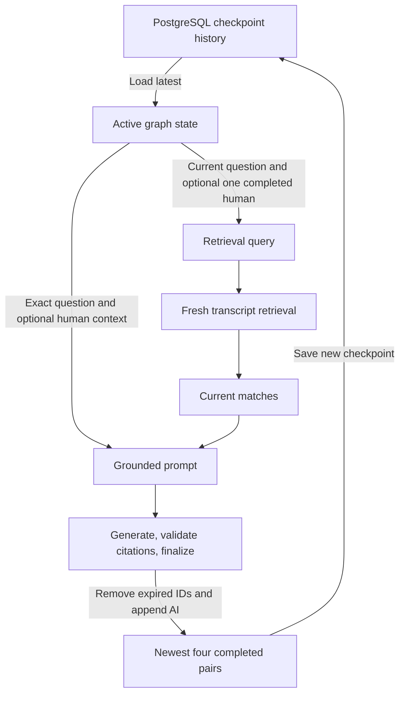

# Stage 6 Implementation and Understanding Packet

Stage 6 bounds ByteLearn's latest active conversation state to the newest four completed human/AI pairs. It also removes abandoned human inputs before a later turn can use them as context. This packet explains the implementation, its tests, and its limits for architecture study and interview preparation.

## A. Repository snapshot and evidence scope

This is a historical Stage 6 implementation record, saved after the repository advanced to Stage 8. It does not attribute later failure-handling improvements or later test results to Stage 6.

| Item | Snapshot |
|---|---|
| Repository | `/home/pranav/projects/ByteLearn` |
| Accepted Stage 6 starting point | Reviewed Stage 5 working tree atop `08b9ca91b9cfe256f2991b5f1d56cc8cc2325314` |
| Separate Stage 5 baseline commit | None; the working tree was reviewed and revalidated before Stage 6 edits |
| Commit containing Stage 6 | `c7131f9cfcf3b39ce2b73986d4878bef5cc5ff58`, which includes both Stage 5 and Stage 6 |
| HEAD when this document was added | `16de776541ebf803b6d51be4faccb0a032fd73d2`, containing later Stage 8 work |
| Worktree before this documentation edit | Clean; `git status --short` returned no entries |
| Stage 6 commit/push evidence | Committed; the earlier read-only enquiry observed local `origin/main` reflog entry `update by push` for the Stage 6-containing commit |
| Deployment | Not verified |
| Verification timing | Test results below are recorded Stage 6 implementation executions from September 23, 2026; they were not rerun to write this document |

The Stage 6 changes are committed. This document is a separate documentation addition. No production code, dependencies, schemas, or tests were changed while creating it.

The Stage 6-specific production diff is one file:

- [src/graphs/conversationalRagGraph.js](../src/graphs/conversationalRagGraph.js).

The Stage 6-specific test changes are:

- [src/test/conversationalRagHistory.stage6.test.js](../src/test/conversationalRagHistory.stage6.test.js): new focused tests.
- [src/test/conversationalRagGraph.test.js](../src/test/conversationalRagGraph.test.js): changed recovery expectations to exclude the abandoned human input.
- [src/test/langgraphPersistence.integration.test.js](../src/test/langgraphPersistence.integration.test.js): extended real-checkpointer continuity, history, identity, and recovery assertions.

There is no new production history module or dependency. Two private helpers live inside the graph file. A parent-to-Stage-6-commit diff also includes Stage 5 persistence work; it must not all be described as Stage 6. See the [Stage 5 evidence packet](stage-5-implementation-evidence.md) for that separate scope.

The four-pair algorithm and dedicated Stage 6 history/integration tests remain present at the documentation snapshot. Later Stage 8 changes add service-unwind/admission handling around graph execution; those changes are described in the [Stage 8 packet](stage-8-implementation-evidence.md), not claimed as Stage 6 work here.

**Stage 6's defined stop condition passed** in the recorded implementation verification: valid bounded pairs, failure cleanup, contextualization/model-input boundaries, and real non-production PostgreSQL continuity were established within the limits below.

## B. Problem, outcome, and completed-turn semantics

Before Stage 6, the message reducer accumulated successful human/AI exchanges without an active-history limit. An invocation could also append its human question and fail before appending an AI response. Those abandoned inputs remained in state and could become the previous human question used to interpret a follow-up.

Stage 5 made that state durable across runtime replacement. A growing active message channel therefore persisted beyond a single process lifetime. Bounding it establishes a predictable recent-history policy and limits the number of conversation messages carried into subsequent checkpoints. It does not bound the database's entire historical checkpoint storage.

Stage 6 introduces two rules:

1. Preparation removes messages that do not belong to completed adjacent human/AI pairs before selecting context and adding the current human.
2. Successful finalization retains the newest four completed pairs, using reducer-aware removal updates.

The relevant objects are distinct:

| Object | Meaning in ByteLearn |
|---|---|
| `HumanMessage` | Current question appended by `prepare_context` |
| Stream fragment | Text emitted through `onToken`; not a completed graph message |
| `state.answer` after generation | Draft text; not yet a completed AI message |
| Finalized `AIMessage` | Answer appended only by `finalize_turn` |
| Completed pair | Adjacent human and AI messages produced by this graph's completion protocol |

A finalized canonical abstention also counts as a completed answer. The classifier does not require that every completed pair contain a factual explanation.

Four is the specified release policy, not an experimentally established optimum. The implementation selects four complete pairs rather than eight arbitrary messages because incomplete turns can disrupt simple alternating history. With fewer than four pairs, all completed pairs remain. After five successful turns, pairs 2–5 remain; after ten, pairs 7–10 remain.

The answer model already received selected context before Stage 6. The stage preserves that boundary; it did not fix an earlier design that automatically sent all saved messages to generation.

Retrieval SQL/ranking/thresholds, model settings, citation policy, routes/controllers, SSE shapes, frontend behavior, connection ownership, setup schema, and tracing policy were not changed by Stage 6. No summarization, token trimming, semantic history selection, query-rewriting model, personalization, or production checkpoint-deletion mechanism was added.

## C. Before and after

| Case | Accepted Stage 5 behavior | Stage 6 behavior |
|---|---|---|
| Active growth | Reducer accumulated messages without a completed-pair cap | Finalization removes IDs outside the newest four pairs |
| Turn 1 | `H1 A1` | Same; nothing expires |
| Turn 4 | `H1 A1 ... H4 A4` | Same; exactly four pairs |
| Turn 5 | Five complete pairs remained | Remove H1/A1 while appending A5 |
| Turn 10 | Ten complete pairs remained | Pairs 7–10 remain |
| Generation failure | Human-only input could persist | Still may persist immediately, but next preparation removes it |
| Cancellation | No completed partial AI before successful finalization | Same completion boundary; later preparation also cleans abandoned input |
| Failure then success | Abandoned human remained beside later successful turns | Abandoned input removed before the next human is appended |
| Repeated failures | Could accumulate unmatched human inputs | Each preparation replaces abandoned inputs with the new current human |
| Recent follow-up | Last human might come from a failed turn | Previous-human candidate comes only from completed pairs |
| Expired reference | No completed-history expiration policy; heuristic still used one preceding human | Removed subject is not recovered from old checkpoints; reference can remain unclear |
| Model prompt | Current question, fresh evidence, optional one prior human | Same selective structure, never the full saved list |
| PostgreSQL | Intermediate and complete history persisted | Reduced latest state persists; older snapshots remain possible |
| Token bound | No history-token budget | Still no history-token budget |

The eight-message limit is a **successful-finalization invariant**. During an ordinary pending or failed turn, four completed pairs plus one current unmatched human can produce nine messages.

A legacy thread with more than four completed pairs is not rewritten by a migration. Preparation removes incomplete messages; its next successful finalization establishes the four-pair bound. Repeated failures do not add more completed pairs or accumulate unmatched inputs, but do not age-trim that legacy completed history before success.

## D. Three separate forms of history

### Latest active graph state

This is the state used to continue the thread from its latest checkpoint. The application fields are `messages`, `videoId`, `question`, `retrievalQuery`, `matches`, `answer`, `sources`, and `status`. Stage 6 bounds completed messages in `messages`, not every byte stored by the checkpointer.

### Retrieval and answer-model input

Contextualization considers at most the immediately preceding completed human question. Retrieval receives the video ID and contextual retrieval query. Generation receives the exact current graph question, fresh matches, and optionally one previous human question. It never receives `state.messages` as its prompt history.

### Historical PostgreSQL checkpoints

The saver can retain earlier snapshots, changed channel blobs, metadata, and pending writes. Loading the latest checkpoint and loading an older checkpoint by ID are different operations. Active removal does not rewrite or delete every historical snapshot.



After turn 10, active messages can be H7/A7 through H10/A10, the next follow-up can use only H10, and an old checkpoint can still contain H1/A1. These facts are compatible.

Eight messages are not a token budget: question and answer lengths vary. The actual model prompt also includes system instructions and fresh transcript evidence. Neither total database storage nor total prompt tokens is bounded by `.slice(-8)`.

## E. Production file map and responsibility boundaries

Paths below are repository-relative; the repository root is `/home/pranav/projects/ByteLearn`.

| File | Responsibility, APIs, inputs and outputs | Stage 6 change and state ownership |
|---|---|---|
| `Backend/src/graphs/conversationalRagGraph.js` | `createConversationalRagGraph` builds execution; `contextualRetrievalQuery` interprets limited follow-ups. Inputs: injected services/saver, `{ videoId, question }`, thread configuration, optional callback/signal. Outputs: `invoke`, `stream`, `getState` and node state updates. Called by runtime. | Only changed production file. Adds private `completedMessages`/`removeExcept`, cleanup and trim. Reads/writes messages and current-turn fields. Does not own HTTP transport, SQL retrieval, pools, or model configuration. |
| `Backend/src/graphs/conversationalRagRuntime.js` | `createConversationalRagRuntime` and singleton own initialization, compiled graph, operation tracking and close. Delegates invocation/state reads. Dependencies: graph, checkpointer resource, hybrid retrieval. Called by controller/startup code. | Unchanged by Stage 6. Does not directly classify or mutate messages. Resource ownership belongs here, separate from graph history policy. |
| `Backend/src/graphs/postgresCheckpointer.js` | `readLangGraphDatabaseUrl`, `createPostgresCheckpointer`, `CHECKPOINT_SCHEMA`. Dedicated URL/pool/saver; resource exposes `ready`, `verify`, `setup`, `close`. Called by runtime and explicit setup script. | Unchanged. Saver persists framework state; wrapper does not inspect history content. Owns connection lifecycle, not retention or prompt construction. |
| `Backend/src/services/ragAnswerService.js` | `buildGroundedMessages`, `streamGroundedAnswerText`, `validateGroundedCitations`, `validateCitations`, `ABSTENTION_RESPONSE`. Receives selected question/evidence/context; returns prompt messages, answer text, or source metadata. Called by graph. | Unchanged. Does not read checkpoints or mutate graph state directly; nodes store its outputs. Owns generation/citation processing, not thread lifecycle. |
| `Backend/src/models/answerChatModel.js` | `createAnswerChatModel`, singleton `answerChatModel`, model name/configuration. Receives constructed messages and optional signal; returns invocation results or streamed text. Called by answer service. | Unchanged by Stage 6. Uses `gemini-2.5-flash-lite`; no direct graph state access. Owns provider adaptation, not evidence/history selection. Later Stage 8 adapter changes are separate. |

The graph is the correct home for pair retention because it defines when a turn completes. The runtime is the correct home for resource lifetime because pools and active operations are not conversation data. The answer service is the correct home for prompt construction because stored state and model inputs are different representations.

`begin()` projects caller input to `{ videoId, question }`, rejecting caller-supplied history/evidence as a state-injection mechanism. Callbacks, signals, clients, and tracing context stay in runtime bindings rather than application state. Evidence/source projections retain only expected serializable fields.

## F. The actual pair algorithm

The complete-pair classifier is:

```js
function completedMessages(messages) {
  const completed = [];
  for (let i = 1; i < messages.length; i += 1) {
    if (messages[i - 1].getType() === "human" && messages[i].getType() === "ai")
      completed.push(messages[i - 1], messages[i]);
  }
  return completed;
}
```

It scans chronological adjacency, selects only human-then-AI neighbors, and preserves their original order. It does not separately collect humans and answers and zip them together. For `H_failed H_success A_success`, only `H_success A_success` qualifies.

This structural definition relies on the current graph protocol: preparation appends humans, generation stores a draft string, citation validation advances status, and only finalization appends a completed AI. There is no separate persisted pair-ID field. It is not a universal repair mechanism for externally corrupted history.

Removal records are generated with:

```js
function removeExcept(messages, retained) {
  const ids = new Set(retained.map((message) => message.id));
  return messages
    .filter((message) => !ids.has(message.id))
    .map((message) => new RemoveMessage({ id: message.id }));
}
```

The set identifies survivors. Filtering finds existing messages outside that set. Mapping produces reducer instructions for those existing IDs. Retained messages are not recreated.

Preparation selects completed history, removes everything outside it, appends the new human, and derives context from the completed selection. It resets `matches` to `[]`, `answer` to `""`, `sources` to `[]`, and `status` to `"pending"`.

The critical finalization excerpt is:

```js
checkCancelled();
if (state.status !== "validated")
  throw new Error("Cannot finalize an unvalidated turn");
const human = state.messages.at(-1);
if (human?.getType() !== "human" || human.content !== state.question)
  throw new Error("Cannot finalize without the current human input");
const answer = new AIMessage(state.answer);
const retained = completedMessages([...state.messages, answer]).slice(-8);
return {
  messages: [...removeExcept(state.messages, retained), answer],
  status: "complete",
};
```

The cancellation/status checks prevent incomplete work from finalizing. The human guard requires the current input at the end of state. The candidate AI makes the newest pair eligible. Since classification emits complete two-message pairs, selecting the last eight keeps four pairs. Old-ID removals and the new answer are returned in one update.

This timing avoids evicting a completed pair merely because a fifth attempt started. An older completed pair expires only when a new completed pair replaces it. Orphan AI messages and unmatched humans are excluded during preparation. The current pair survives because it is last in the candidate sequence.

## G. Installed reducer/removal semantics

The inspected versions are LangGraph **1.4.13**, Core **1.2.11**, and PostgreSQL saver **1.0.5**. The authority is the installed reducer at `Backend/node_modules/@langchain/langgraph/dist/graph/messages_reducer.js` and saver implementation under `Backend/node_modules/@langchain/langgraph-checkpoint-postgres/dist/`.

The graph's message annotation uses `messagesStateReducer`. That reducer merges updates by ID:

| Update | Behavior |
|---|---|
| Ordinary message with a new ID | Append |
| Ordinary message with an existing ID | Replace that existing message |
| `RemoveMessage` with an existing ID | Remove that ID from the resulting list |
| `RemoveMessage` with an unknown ID | Throw |
| Existing message omitted from update | Keep it |

Therefore `return { messages: state.messages.slice(-8) }` would not establish deletion: omitted messages still exist in the reducer's prior value.

Stage 6 imports `RemoveMessage` from `@langchain/core/messages` and emits `new RemoveMessage({ id })`. This installed version also supports `REMOVE_ALL_MESSAGES`; Stage 6 does not use that sentinel.

The reducer assigns UUIDs to ordinary messages whose IDs are null/undefined, updating both `id` and `lc_kwargs.id`. The current human already has an ID by finalization; the new AI receives one as its update is reduced. Its candidate ID is not needed to remove old messages because removal candidates come only from existing state.

Stable IDs prevent a retained message from being mistaken for a newly appended message. Reusing an ID can replace a message; recreating survivors with new IDs can introduce duplicates; removing an unknown ID throws. Missing-ID assignment is not general repair for malformed or duplicated IDs. Tests verify nonempty unique IDs and retained identity through updates and reloads.

Removal objects are instructions, not conversational turns in the reduced active list. Framework pending-write records can still retain those instructions. The checkpointer persists the reduced channel value; message removal does not invoke SQL deletion of all old snapshots.

## H. Ten-turn state trace

`Hn` and `An` denote messages of successful turn n. Before finalization, answer text is in `state.answer` with status `validated`; the completed AI message does not yet exist.

| Boundary | Latest active messages |
|---|---|
| After 1 | `H1 A1` |
| After 2 | `H1 A1 H2 A2` |
| After 3 | `H1 A1 H2 A2 H3 A3` |
| After 4 | `H1 A1 H2 A2 H3 A3 H4 A4` |
| Before finalizing 5 | `H1 A1 H2 A2 H3 A3 H4 A4 H5` |
| After 5 | `H2 A2 H3 A3 H4 A4 H5 A5` |
| After 6 | `H3 A3 H4 A4 H5 A5 H6 A6` |
| After 7 | `H4 A4 H5 A5 H6 A6 H7 A7` |
| After 8 | `H5 A5 H6 A6 H7 A7 H8 A8` |
| After 9 | `H6 A6 H7 A7 H8 A8 H9 A9` |
| Before finalizing 10 | `H6 A6 H7 A7 H8 A8 H9 A9 H10` |
| After 10 | `H7 A7 H8 A8 H9 A9 H10 A10` |

Turn 5 emits `RemoveMessage(id(H1)), RemoveMessage(id(A1)), A5`. Turn 10 emits removals for H6/A6 and appends A10; earlier pairs have already expired.

The finalizer locally examines five candidate pairs. It does not save a successful five-pair state and later run a separate trim node. Addition and removal are part of one finalization update.

The ten-turn test directly asserts every successful result and latest checkpoint. The separate finalization-update test explicitly captures turn 5's `remove, remove, ai` update and its IDs. Turn 10's final state is directly tested; its particular removal sequence also follows from the same inspected algorithm.

## I. Failure/cancellation followed by success

Consider Q1 and Q2 succeeding, Q3 failing during generation, and Q4 succeeding:

| Boundary | Messages | Status / answer | Completion and persistence |
|---|---|---|---|
| Q1 prepared | `H1` | Pending; empty answer | Human may be checkpointed |
| Q1 finalized | `H1 A1` | Complete; A1 text | One completed pair |
| Q2 prepared | `H1 A1 H2` | Pending; current fields reset | No A2 yet |
| Q2 finalized | `H1 A1 H2 A2` | Complete; A2 text | Two completed pairs |
| Q3 prepared | `H1 A1 H2 A2 H3` | Pending; empty answer/sources/matches | H3 can persist |
| Q3 retrieved | Same | Pending; fresh Q3 matches | Evidence can persist |
| Q3 generation fails/cancels | Same | In this scenario pending; empty graph answer | No A3; no finalization |
| Q4 prepared | `H1 A1 H2 A2 H4` | Pending; Q4 fields reset | Remove H3, append H4 |
| Q4 generated | Same | Draft; A4 text | Draft can persist; no AI message |
| Q4 citation processing completes | Same | Validated; current source metadata | Still no A4 message |
| Q4 finalized | `H1 A1 H2 A2 H4 A4` | Complete | Three completed pairs |

These are node-result boundaries, not an exhaustive list of framework input/task checkpoints. A failed invocation does not roll back all earlier persisted nodes.

Streamed Q3 fragments may have reached the client. They live in the service's local accumulation and token channel until generation returns; they are not automatically completed graph messages. A later citation-validation failure can instead leave `answer` containing a draft and status `draft`, still without A3.

Q4 preparation emits `RemoveMessage(id(H3)), H4`. A4 is then appended directly after H4, and the finalizer checks the current human. Q3 cannot receive A4 through the supported graph path. If Q4 is `Why?`, context comes from completed Q2, not abandoned Q3.

The dedicated tests run six repeated failures at retrieval, generation, validation, and cancellation boundaries using actual graph checkpoints. After four successes, each failed state has eight completed messages plus one unmatched human. The graph is reconstructed over the same saver and recovery is checked. Real PostgreSQL tests also close/reopen runtimes across repeated generation failures/cancellations.

Cleanup waits for the next preparation. If no next request occurs, the last unmatched human can remain, but it is not a completed pair. No synthetic error AI response is manufactured.

## J. Follow-up and expired-context cases

The deterministic English heuristic considers questions of at most 16 words that match a continuation or contain backward-reference words such as `it`, `that`, or `those`. Recognized topic-change prefixes suppress inheritance. Only the immediately preceding completed human question is considered; the code does not search all four pairs for a better subject.

| Scenario | Current question | Prior human considered | Query and result |
|---|---|---|---|
| Retained follow-up | `Why?` | `Explain closures.` | `Explain closures.\nWhy?`; integration fixture freshly retrieves `Closures capture lexical bindings.`; generation receives one previous human |
| Explicit topic change | `New topic: explain gravity.` | Prior question exists but inheritance is suppressed | Current question alone; fresh retrieval; generation receives no previous question |
| Follow-up to new topic | `Give an example.` | `New topic: explain gravity.` | Concatenate the two; fresh retrieval and one-human interpretation |
| Expired subject | `How does that work?` | `Why?`, after the explicit old subject expired | `Why?\nHow does that work?`; no expired subject supplied |
| False old AI, no current evidence | `Why?` | `Question 5` in the test | `Question 5\nWhy?`; matches are empty; no generation or citation-validation call |

The expired-subject test first completes `EXPIRED_SUBJECT closures` and four `Why?` turns. It verifies the expired marker is absent from active state and subsequent generation input. Questions such as `Why is that useful?` use the same pronoun heuristic, but that exact wording is a code-derived example, not the literal test input.

This proves the application does not reintroduce removed context. It does not prove a model cannot guess, or that weak contextual queries always retrieve useful evidence. There is no dedicated ambiguity detector: nonempty matches can still lead to generation.

The false-history test saves `FALSE_PRIOR: the moon is cheese [Source 1].` and then supplies zero current matches. The finalized answer is exactly:

> I couldn't find enough information in this video to answer that.

This demonstrates the zero-evidence boundary, not general prompt-injection resistance.

## K. Actual answer-model input

The path is graph generation → `streamGroundedAnswerText` → `buildGroundedMessages` → `answerChatModel.stream` → Google model adapter.

| Value | Sent to model? | Other use / reason |
|---|---|---|
| Exact current graph question | Yes | Final human prompt message; public controller already applies its existing question trim |
| Contextual retrieval query | Not as a replacement question field | Used by fresh retrieval |
| Previous human question | Optionally one | Interpretation only when heuristic inheritance occurred |
| Previous AI answers | No | Stored completed records, not factual input |
| Fresh transcript matches | Yes | Labeled current evidence and basis for current citation IDs |
| Citation/abstention instructions | Yes | System message |
| Entire saved message list | No | Used by graph for retention and context selection only |
| Old checkpoint snapshots | No | Not loaded by generation |
| Callback/signal/client | No prompt text | Runtime control/dependencies |

The real prompt builder is:

```js
export const buildGroundedMessages = (question, matches, { previousQuestion } = {}) => [
  new SystemMessage(SYSTEM_INSTRUCTIONS),
  ...(previousQuestion ? [new HumanMessage(
    `Previous human question (for interpreting the follow-up only, NOT factual evidence):\n${previousQuestion}`
  )] : []),
  new HumanMessage(`Question:\n${question}\n\nTranscript context:\n${buildContextText(matches)}`),
];
```

A standalone prompt has two messages; a contextual follow-up has three. These are constructed model messages, not the retained four conversation pairs.

The dedicated model-input test completes five questions, then captures the sixth follow-up at the model stream boundary. It asserts roles `system, human, human`, only `PRIVATE_QUESTION_5` as previous context, and only `PRIVATE_EVIDENCE_6` as evidence. It excludes prior AI text, questions 1–4, evidence 1–5, and an injected runtime client. It also checks exact current-question whitespace preservation at the graph boundary, current citation IDs, checkpoint serialization, and trace privacy.

Provider I/O is stubbed, while the real graph/service/model adapter runs. This proves the application-side input boundary, not a live Gemini response or provider internals. Previous AI text being stored does not make it factual evidence; fresh retrieval and model compliance remain separate concerns.

## L. PostgreSQL interaction

The unchanged Stage 5 runtime initializes and verifies its dedicated PostgreSQL saver, then injects it into the graph. Production has no silent memory fallback. Direct isolated graph construction can still default to `MemorySaver` for tests.

With `durability: "sync"`, graph execution persists checkpoint updates synchronously. The reducer first creates the next message-channel value. `PostgresSaver.put()` serializes changed channels as versioned blobs and stores checkpoint metadata in a transaction. Pending/intermediate writes can also be stored.

Without a checkpoint ID, `getTuple()` selects the latest checkpoint for the thread/namespace. With an explicit ID, it can load an older snapshot. Deserialization restores message objects and IDs.

| Evidence layer | Established behavior |
|---|---|
| Production code | ID removals change current channel state; saver is injected; no production retention deletion |
| Real graph with `MemorySaver` | Actual node/reducer/checkpoint behavior, failure residue, identity, old snapshots |
| PostgreSQL integration test | Genuinely distinct runtime/saver/pool instances restore bounded state |
| Recorded live non-production execution | Expanded test passed on disposable localhost PostgreSQL 16 |
| Production assumptions | Configuration, prepared tables, permissions, availability, proxy behavior, and deployment lifecycle were not proved by the disposable test |

The integration completes ten turns, closes the runtime, creates a new one, and verifies pairs 7–10 and unchanged IDs. It rereads the first checkpoint and finds the original pair, then continues with `Why?` contextualized by `Question 10`. Separate conversation and video scopes remain isolated. Repeated failed/cancelled invocations also recover through new runtimes.

The controller derives the thread ID from SHA-256 of `JSON.stringify([videoId, conversationId.toLowerCase()])`. The graph also rejects using a thread bound to another video. This is scoping, not authentication.

This was real database continuity through resource replacement, not a complete Express-process restart. Test teardown calls `deleteThread()` for unique synthetic IDs; that is not production checkpoint retention. Active trimming is context management, not guaranteed data erasure.

## M. Guarantees and evidence matrix

| Property | Mechanism | Evidence / strength | Limitation |
|---|---|---|---|
| Newest four pairs | Finalization classifies and selects eight, removes other IDs | Exact ten-turn graph test; real PostgreSQL integration | Successful-finalization boundary |
| Pair order | Adjacent human/AI selection preserves order | Exact roles/content in unit and DB tests | Relies on graph append protocol |
| Stable IDs | Reducer assigns IDs; survivors not recreated | Uniqueness/nonempty checks and reload comparisons | No arbitrary-ID corruption repair |
| No orphan completed AI | Pair selection plus current-human guard | Legacy orphan test; normal persisted role assertions | Not provenance validation for external data |
| Failed input excluded | Preparation removes unmatched inputs | Failure/recovery and failed-only-context tests; DB loops | Cleanup occurs on next preparation |
| Repeated failures bounded | Remove abandoned input before append | Six repetitions at four unit-test boundaries; DB failure/cancel loops | Historical checkpoint storage still grows |
| Recent follow-up | Last completed human plus heuristic | Exact queries and generation arguments; DB continuity | Only one human question considered |
| Expired subject absent | No historical-snapshot lookup for context | Marker absence in state/model arguments | Model guessing not disproved |
| Fresh retrieval | Preparation routes through retrieval | Call counts and evidence assertions; DB test | Early cancellation/failure can interrupt |
| Old AI not evidence | Prompt excludes old AI | Actual model-boundary capture | No live model faithfulness guarantee |
| Zero evidence skips model | Empty-match abstention branch | False-history test checks no extra generation/validation | Nonempty evidence may still be insufficient |
| Full history not sent | Selected service inputs and prompt builder | Exact prompt-role/content assertions | Not provider-internal inspection |
| Bound survives recreation | Reduced state persisted by official saver | Real PostgreSQL new-instance verification | Not full server-process restart |
| Conversation isolation | Scoped thread hash | Controller/integration evidence | Identity is not access control |
| Video isolation | Video in hash and graph binding | Graph/controller/integration evidence | Distributed writer coordination unchanged |
| Old checkpoints remain | No production deletion | First snapshot reread after turn 10 in memory and PostgreSQL | External policies/backups uninspected |
| No token bound | Count-based selection only | Direct code inspection | Variable message/evidence lengths |
| Runtime/tracing privacy | Projections and existing trace suppression | Serialization/trace marker assertions | Not a guarantee that arbitrary text contains no sensitive content |

## N. Recorded tests and commands

The new Stage 6 file contains **11 cases**. It covers successful bounds, finalization timing, repeated retrieval/generation/validation/cancellation failures, legacy orphan cleanup, failed-only context, retained/expired/topic-change context, false-history abstention, and actual prompt/privacy boundaries. Tests use the actual graph and saver behavior; provider/retrieval I/O is controlled. The PostgreSQL integration uses real infrastructure with synthetic retrieval/generation.

All commands below ran from the repository root during implementation. The local database URL is a historical disposable target, not a currently available or production endpoint. No commands in this section were rerun while writing the packet.

**Stage 5 baseline revalidation — exit 0; 111 passed, 7 files:**

```bash
LANGGRAPH_TEST_DATABASE_CONFIRMED=false npm test --prefix Backend -- \
  src/test/conversationalRagGraph.test.js \
  src/test/conversationalRagRuntime.test.js \
  src/test/postgresCheckpointer.test.js \
  src/test/langgraphSetup.test.js \
  src/test/backendPersistenceStartup.test.js \
  src/test/answerController.stage4.test.js \
  src/test/answerController.observability.test.js
```

**Historical disposable database setup — exit 0:**

```bash
LANGGRAPH_DATABASE_URL=postgresql://postgres@127.0.0.1:56906/bytelearn_stage6_test npm run langgraph:setup --prefix Backend
```

**Pre-edit Stage 5 continuity — exit 0; 1 integration test passed:**

```bash
LANGGRAPH_DATABASE_URL=postgresql://postgres@127.0.0.1:56906/bytelearn_stage6_test LANGGRAPH_TEST_DATABASE_CONFIRMED=true npm test --prefix Backend -- src/test/langgraphPersistence.integration.test.js
```

These baseline results are not newly added Stage 6 tests.

**Initial Stage 6 focused run — exit 1; 34 passed, 1 failed, 2 files:**

```bash
LANGGRAPH_TEST_DATABASE_CONFIRMED=false npm test --prefix Backend -- src/test/conversationalRagHistory.stage6.test.js src/test/conversationalRagGraph.test.js
```

The failing assertion incorrectly excluded the framework `__pregel_tasks` checkpoint channel. The test was corrected; this failure did not require a production change.

**Final focused Stage 6 and regression run — exit 0; 123 passed, 9 files:**

```bash
LANGGRAPH_DATABASE_URL=postgresql://postgres@127.0.0.1:56906/bytelearn_stage6_test \
LANGGRAPH_TEST_DATABASE_CONFIRMED=true npm test --prefix Backend -- \
  src/test/conversationalRagHistory.stage6.test.js \
  src/test/conversationalRagGraph.test.js \
  src/test/conversationalRagRuntime.test.js \
  src/test/postgresCheckpointer.test.js \
  src/test/langgraphSetup.test.js \
  src/test/backendPersistenceStartup.test.js \
  src/test/answerController.stage4.test.js \
  src/test/answerController.observability.test.js \
  src/test/langgraphPersistence.integration.test.js
```

This included the expanded real PostgreSQL integration test. Runtime/setup/startup tests check ownership, no fallback, readiness and drain behavior. Controller regressions check public transport, isolation, overlap, privacy, and completed persistence versus client delivery.

**Full backend suite, run once — exit 0; 244 passed, 20 files; none skipped:**

```bash
LANGGRAPH_DATABASE_URL=postgresql://postgres@127.0.0.1:56906/bytelearn_stage6_test LANGGRAPH_TEST_DATABASE_CONFIRMED=true npm test --prefix Backend
```

The full suite also includes answer-service/model, tracing, and retrieval-evaluation tests. It is not 244 newly written Stage 6 tests. Later-stage suite counts must not replace this recorded Stage 6 result.

**Syntax/whitespace check block — exit 0, no diagnostics:**

```bash
node --check Backend/src/graphs/conversationalRagGraph.js
node --check Backend/src/test/conversationalRagHistory.stage6.test.js
node --check Backend/src/test/conversationalRagGraph.test.js
node --check Backend/src/test/langgraphPersistence.integration.test.js
git diff --check
```

There was no applicable backend JavaScript lint/type script; `tsconfig.json` has `checkJs: false`. Syntax checks are not type checking. The integration requires explicit test confirmation and a safe configured database; the confirmation flag alone cannot prove target safety. The disposable PostgreSQL container was stopped and removed after verification.

Not live-tested for Stage 6: complete backend-process restart, deployment, production retention, browser behavior, real Gemini responses, or LangSmith dashboard behavior. This document preserves the recorded results rather than claiming a fresh test run.

## O. Alternatives and tradeoffs

| Policy | Benefit | Cost/risk | Stage 6 decision |
|---|---|---|---|
| Four recent completed pairs | Deterministic retention, clear turn boundaries, small implementation | Old context expires; no token bound | Required release policy |
| Unbounded active history | Simple append behavior; old turns remain available | Growing active channel and serialization; more retained content; possible relevance drift for consumers | Does not satisfy active bound |
| Token-budget trimming | More direct control over selected prompt tokens | Tokenizer/budget dependence and oversized-pair decisions | Explicitly outside scope |
| Summarization | Compact longer conceptual memory | Extra model calls, distortion, grounding confusion, summary lifecycle | Explicitly excluded |
| Semantic selection | Can recover older relevant turns | Extra selection/indexing, latency, less predictable behavior | Outside deterministic recent-pair scope |

The chosen policy is not universally superior. No performance/token benchmark was recorded. Since full history was not previously sent to generation, Stage 6 must not be described as reducing an unbounded model prompt to four pairs. It bounds active saved messages; old checkpoint storage can continue growing.

## P. Limitations and non-guarantees

- Four pairs can contain many tokens; fresh evidence and instructions also affect prompt size.
- Pending/failed state can contain an additional human. Legacy oversized completed state is trimmed at its next successful finalization.
- Useful context can expire; there is no summary or hidden recovery from old checkpoints.
- The heuristic considers one preceding completed human and may misinterpret or fail to resolve references.
- Historical snapshots, drafts, evidence, and metadata can retain removed content. Trimming is not privacy deletion.
- Prior AI records are excluded from model evidence, but live model faithfulness is not mathematically guaranteed.
- Citation-ID filtering selects valid current source metadata; it does not prove factual support or necessarily remove invalid citation text from the answer.
- Persistence is not exactly-once delivery. A completed checkpoint can precede a lost `done`; retry can add another turn.
- Browser-visible history is separate. The frontend owns its message list; session storage preserves conversation identity rather than restored messages. Stage 6 adds no UI-history synchronization.
- Structural pair recognition is not general repair for arbitrary externally corrupted checkpoints or duplicate IDs.
- Same-thread overlap protection remains process-local. No distributed lock was added.
- New-instance PostgreSQL continuity is not a complete deployed-server restart or crash-recovery demonstration.
- Stage 6 tests do not prove production retention policies, browser behavior, real Gemini answers, or a live tracing dashboard.

## Q. Interview preparation

### Seven facts to know

1. `messagesStateReducer` merges updates; omission is not deletion.
2. Only `finalize_turn` appends a completed AI message.
3. Complete adjacent pairs are classified before selecting the last eight messages.
4. `RemoveMessage({ id })` removes expired active messages without recreating retained identities.
5. Preparation removes abandoned inputs before selecting follow-up context.
6. Generation receives current evidence and optionally one previous human, not four saved pairs.
7. Latest-state trimming and historical PostgreSQL retention are separate.

### 30-second explanation

“I added a deterministic recent-history policy to ByteLearn's conversational graph. After a successful turn it keeps four completed human/AI pairs. Failed inputs are removed when the next turn starts, so they cannot receive a later answer or become its previous-question context. Because LangGraph merges messages by ID, I used explicit removal records. The bounded state survives PostgreSQL runtime recreation, but older checkpoints remain possible. Generation still uses fresh transcript evidence and minimal human context.”

### 90-second explanation

“ByteLearn's persistent graph accumulated completed exchanges and human inputs from failed invocations. I established a small active-state invariant without changing retrieval or the grounding contract.

The graph identifies completed turns as adjacent human/AI messages. That works because preparation appends humans, generation stores a draft string, and finalization alone appends AI messages. Preparation removes incomplete historical inputs before choosing context. Finalization checks cancellation, validated status and the current human, constructs the eligible answer, selects four recent pairs, and returns old-ID removals plus the new answer together.

Explicit removals matter because the message reducer merges arrays by ID; returning a shorter list would not delete omitted state. Tests cover ten turns, repeated failures, cancellation, IDs, actual model prompts, and real PostgreSQL resource replacement.

The model receives fresh evidence and at most one prior human question, not the retained message history. Four pairs are predictable but not a token budget, can lose useful context, and do not erase old checkpoints.”

### Five-minute code walkthrough

| Time | Open/explain | Point |
|---|---|---|
| 0:00–0:40 | Graph `begin`, state annotation | Input projection, scoped thread, reducer-managed messages |
| 0:40–1:30 | `prepare_context`, `completedMessages` | Remove abandoned input, select one human context, reset current fields |
| 1:30–2:15 | Retrieval, generation, citation nodes | Fresh evidence; draft text is not a completed AI |
| 2:15–3:10 | `finalize_turn`, `removeExcept` | Current pair eligibility, four-pair selection, ID-removal update |
| 3:10–3:50 | Runtime/checkpointer | Reduced state persists; old snapshots are separate |
| 3:50–4:20 | `buildGroundedMessages` | Actual prompt is selected current input/evidence |
| 4:20–5:00 | History and PostgreSQL tests | Exact state, recovery, prompt capture, new-instance reload |

### Likely questions

| Question | Short answer | Follow-up / interviewer concern |
|---|---|---|
| Why four pairs? | Required deterministic release policy, not a proven optimum. | Was it benchmarked? Scope honesty. |
| Why not last eight messages? | Incomplete inputs can split turn structure; classify pairs first. | Show `H_failed H_success A_success`. |
| Why finalization? | Evict a completed pair only after a new pair completes. | What if the fifth attempt fails? |
| Why not return a shorter array? | Reducer merges; omission keeps prior messages. | Explain `RemoveMessage`. |
| Why stable IDs? | Replacement/removal are keyed by ID. | Duplicates can replace instead of append. |
| What happens after generation failure? | Human may persist, no completed AI; next preparation cleans it. | Drafts can persist after later-stage failure. |
| Can Q3 receive Q4's answer? | Q3 is removed before H4; finalizer checks current human. | Evidence from recovery tests. |
| What about six-turn-old references? | No hidden old-snapshot lookup; reference may remain unclear. | No dedicated ambiguity detector. |
| Why not summarize? | Extra generation, distortion and memory lifecycle were outside scope. | Summary must not become factual evidence. |
| Does trimming erase PostgreSQL history? | No; test rereads an earlier checkpoint. | Active context versus data retention. |
| Is eight a token limit? | No, lengths vary and evidence also consumes tokens. | Count versus token budget. |
| Can old AI hallucinations ground a response? | Old AI text is not passed; zero evidence skips generation. | Model can still independently err. |
| How do you know full history is not sent? | Capture actual model-boundary messages after multiple turns. | Provider I/O was stubbed, not live Gemini. |
| What happens after restart? | New runtime/saver/pool loads bounded state by scoped ID. | Full backend process restart was not tested. |
| Does commit mean delivery? | No; state can commit before client misses `done`. | Retry is not exactly once. |

Avoid claiming that all old PostgreSQL data is deleted, active state never exceeds eight messages, the model sees four pairs, eight messages fix prompt size, citation IDs prove truth, failed turns leave no data, references always resolve, summarization exists, or production restart/live Gemini behavior was verified.

## R. STAGE 6 PDF SYNTHESIS FACTS

- **Baseline:** reviewed Stage 5 working tree atop `08b9ca91b9cfe256f2991b5f1d56cc8cc2325314`; no separate Stage 5 baseline commit.
- **Stage 6 commit:** `c7131f9cfcf3b39ce2b73986d4878bef5cc5ff58`, containing Stages 5 and 6. Documentation-time HEAD is later `16de776541ebf803b6d51be4faccb0a032fd73d2`.
- **Outcome/stop condition:** implemented and passed for recorded Stage 6 scope; not a deployment/live-model claim.
- **Production change:** `Backend/src/graphs/conversationalRagGraph.js` only; two private helpers, no new production dependency/module.
- **Tests:** added `conversationalRagHistory.stage6.test.js`; updated `conversationalRagGraph.test.js` and `langgraphPersistence.integration.test.js`, all under `Backend/src/test/`.
- **API:** LangGraph 1.4.13 `messagesStateReducer`; Core 1.2.11 `RemoveMessage({ id })`; saver 1.0.5. Retained IDs preserved.
- **Policy:** newest four adjacent completed human/AI pairs after successful finalization; finalized abstentions count. Turn 5 keeps pairs 2–5; turn 10 keeps 7–10.
- **Incomplete policy:** next preparation removes unmatched/orphan messages before adding the new human or selecting context. No synthetic AI. Pending state can include one unmatched human; legacy completed history trims on successful finalization.
- **Context:** narrow heuristic, at most immediately preceding completed human; explicit topic changes suppress inheritance.
- **Model input:** exact current graph question, fresh transcript matches, optional one human interpretation message; no previous AI/full saved history/old checkpoints. Zero evidence skips generation.
- **Persistence:** unchanged Stage 5 PostgreSQL lifecycle; reduced latest state survives new runtime/saver/pool. Old checkpoints remain readable; no production retention deletion.
- **Results:** new file has 11 cases; final focused run 123 passed/9 files; full backend run 244 passed/20 files, none skipped; both exit 0. Expanded real PostgreSQL test passed in both. Exact commands are in N.
- **Checks:** syntax and diff checks passed; no applicable JS lint/type script. Tests were not rerun to create this document.
- **Verified:** pair bounds/order/IDs, failure recovery, minimal context, fresh evidence, prompt exclusion, tested runtime/tracing privacy, persisted continuity and isolation.
- **Limits:** not token-bounded, not semantic truth verification, not database erasure, heuristic references, possible context loss, process-local concurrency assumptions, not exactly-once client delivery.
- **Unverified:** complete backend-process restart, deployed behavior, production retention, browser behavior, live Gemini, LangSmith dashboard.
- **Git:** Stage 6 committed; earlier local reflog recorded its push. Deployment unknown. Worktree was clean before this separate documentation addition; no commit/push/deployment performed to write it.
